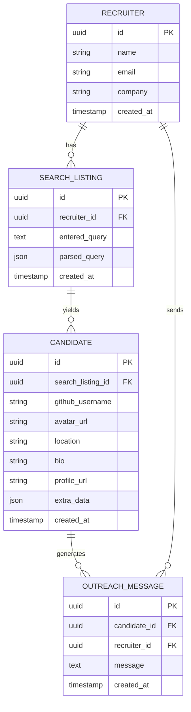

### ✅ Entity Relationships

---

### 🛡️ Row-Level Security (RLS)

- **Recruiters can only access:**

  - Their own `SEARCH_LISTING` entries (`recruiter_id = auth.uid()`)
  - `CANDIDATE` entries linked to their listings
  - `OUTREACH_MESSAGE` entries linked to them

---

### 📝 Notes

- `parsed_query` in `SEARCH_LISTING` can store structured filters (skills, location, etc.)
- `extra_data` in `CANDIDATE` can store raw JSON from the GitHub API (followers, repos, etc.)
- You can choose to store or generate outreach messages on the fly (but it’s good to cache/save if possible for tracking or re-sending)
