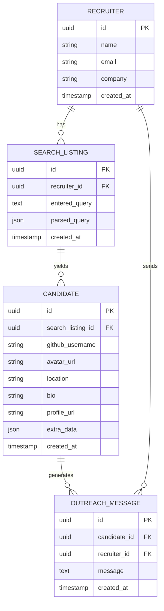

Build me a functional MVP called **HireAI**, a recruiter-facing tool that allows authenticated recruiters to input natural-language job descriptions and receive candidate matches using the GitHub API. The tool should support storing listings, displaying results, and sending personalized outreach emails.

### 🧠 Summary

A recruiter logs in, enters a search query like:

> "Find senior Gen-AI engineers with LangChain + RAG experience in Europe, open to contract work"

The system:

1. Parses this query into structured filters (job role, skills, location, etc.)
2. Uses GitHub's public **Search Users API** to find matching developer profiles
3. Displays the top candidates in a dashboard
4. Allows the recruiter to click and generate an **outreach email** via **GroqCloud LLM**
5. Provides a button to **send the email** to that candidate via **Resend API**

### 🧱 Stack

- **Frontend**: Vite + React + Tailwind CSS (Single Page App). Keep the codebase clean and modular, and simple.
- **Backend & DB**: Supabase (Postgres, Auth, RLS enabled)
- **AI Provider**: GroqCloud (via OpenAI-compatible API, use Mixtral or Gemma-7B)
- **Candidate Source**: GitHub Search API (https://docs.github.com/en/rest/search/search?apiVersion=2022-11-28#search-users)
- **Candidate Details**: GitHub Search API (https://docs.github.com/en/rest/search/search?apiVersion=2022-11-28#search-users)
- **Email Sending**: Resend API (https://resend.com/docs)

### ⚙️ Core MVP Functionality:

1.  **Authentication**

    - Use Supabase Auth (email/password or GitHub OAuth)
    - Store recruiter metadata (name, email, company, etc.)

2.  **Search Listings**

    - Recruiter enters a natural-language search query.
    - Store the raw query in a `search_listings` table.
    - Parse query into structured fields: jobRole, skills, location, employmentType.

3.  **GitHub Candidate Sourcing**

    - Use [GitHub Search Users API](https://docs.github.com/en/rest/search/search?apiVersion=2022-11-28#search-users) with the parsed query.
    - Retrieve the top 10–50 matching GitHub usernames.

4.  **GitHub User Details API**

    - For each username returned, call [GET /users/{username}](https://docs.github.com/en/rest/users/users?apiVersion=2022-11-28#get-a-user)
    - Store the enriched details (bio, location, followers, public repos, avatar URL) in a `candidates` table linked to the search listing.

5.  **Dashboard**

    - Show all past searches for a recruiter.
    - For each search, show a paginated list of matching candidates with filters.

6.  **Outreach Email Generation**

    - For any candidate, click a button to generate a personalized outreach email using GroqCloud.
    - Allow recruiter to review and optionally send the email.
    - Store or log the outreach message.

### 👥 Users

- Only one user type: `Recruiter`
- Must be authenticated via Supabase
- Recruiter data includes: `id`, `email`, `name`, `company`, `created_at`

### 📦 Tables

1. `recruiters`: Supabase-managed auth info (linked via `auth.uid()`)
2. `search_listings`: stores recruiter queries (`entered_query`, `parsed_query`, recruiter FK)
3. `candidates`: candidates returned from GitHub API, linked to `search_listings`
4. `outreach_messages`: stores personalized outreach email text per candidate

### ✅ ERD Diagram

### 🔐 Security

Use **Supabase Row-Level Security (RLS)** to ensure recruiters can only:

- View their own `search_listings`
- View candidates linked to their listings
- View and manage their own `outreach_messages`

### 🧭 Frontend Functionality

- Login/signup page (via Supabase)
- Dashboard to show:
  - All search listings by the recruiter
  - Top 10 candidate matches per listing
- A search bar for recruiters to enter plain English queries
- Button to "Generate Outreach Email" (via GroqCloud)
- Button to "Send Email" (via Resend API)

### 🧠 LLM Usage

Use GroqCloud's OpenAI-compatible endpoint to:

- Parse recruiter query into structured filters (`jobRole`, `skills`, `location`, etc.)
- Generate outreach messages personalized for a candidate using their GitHub profile data

### 📨 Email

Emails should be sent using Resend API. The system should allow the recruiter to:

- Preview/edit the message before sending
- See whether a message was already sent

### 🌍 Dev Environment

- Include `.env.example` for required keys (Supabase, Groq, Resend)
- Provide an SQL file (`schema.sql`) to create the tables
- Document everything in `README.md`

### ✅ MVP Constraints

- Keep UI minimal but clean
- Focus on functionality, not polish
- Should work on Supabase free tier and GroqCloud/Resend free tiers

Output a complete project with:

- Working Vite frontend
- Supabase backend schema
- API integration logic
- LLM calls and Resend calls
- Auth, RLS, and data visibility per recruiter
